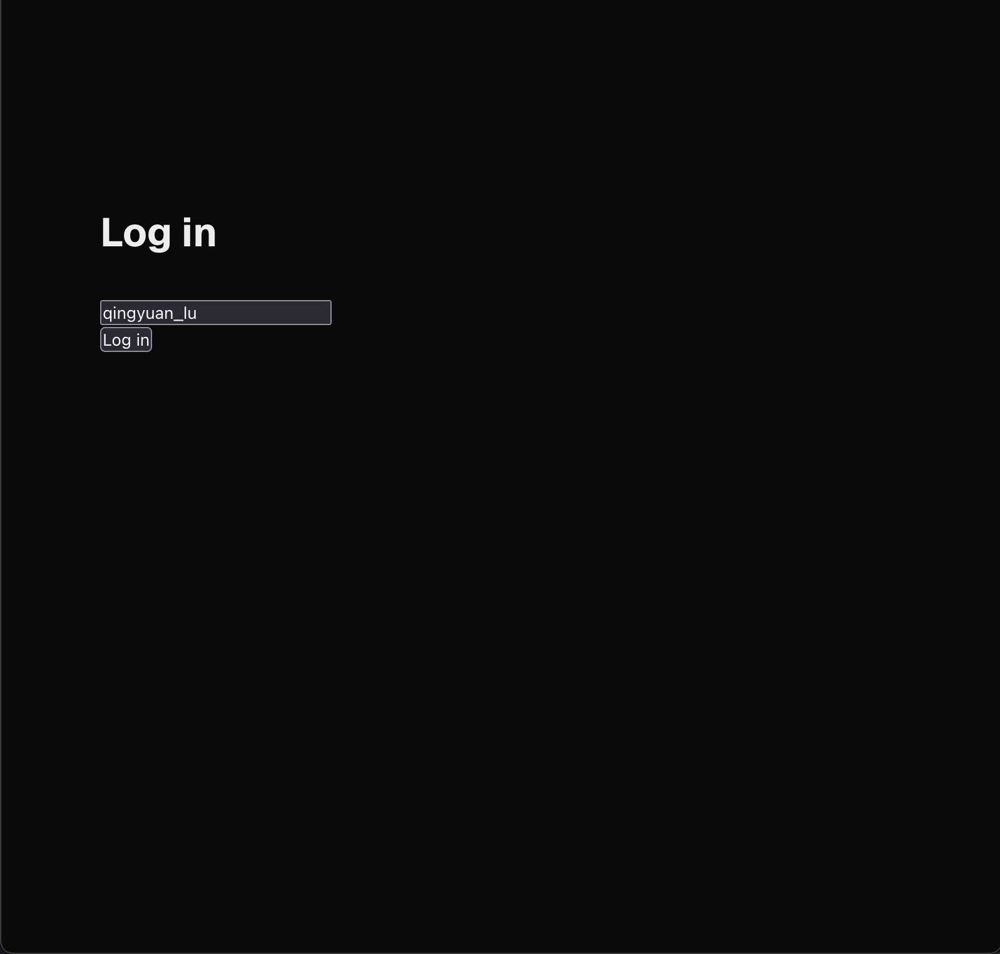
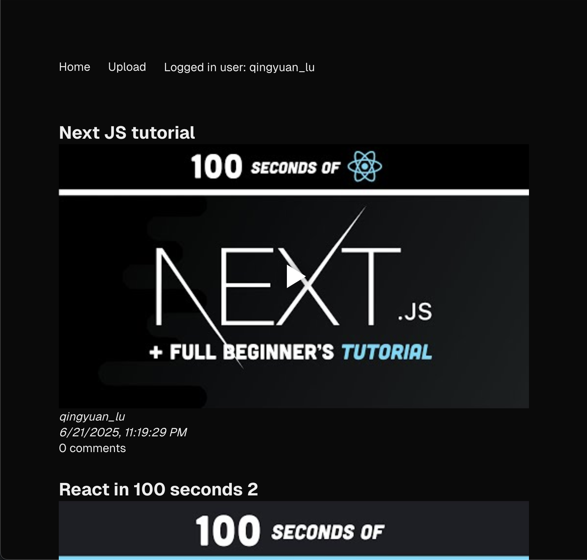
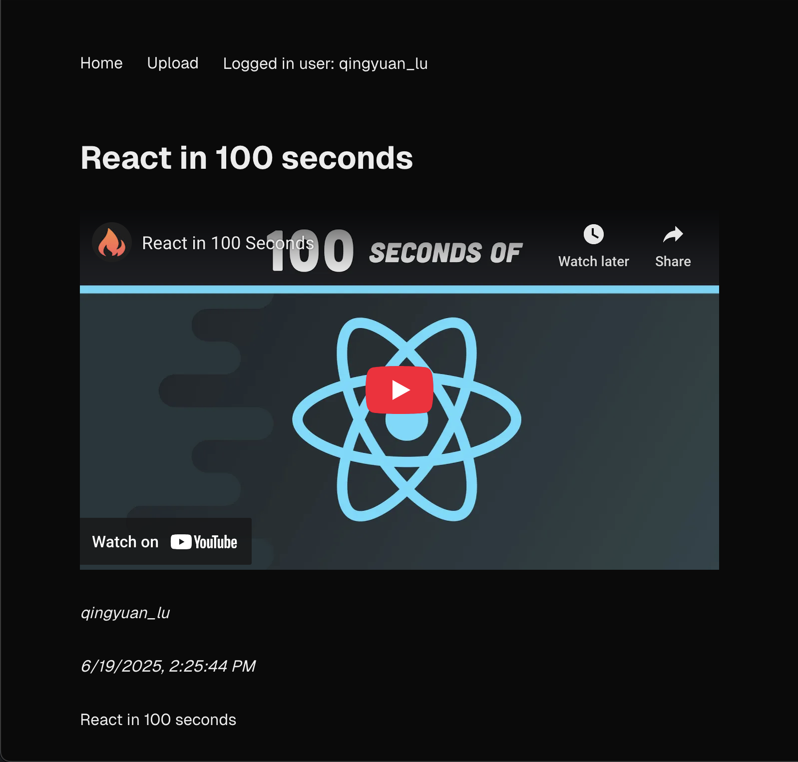
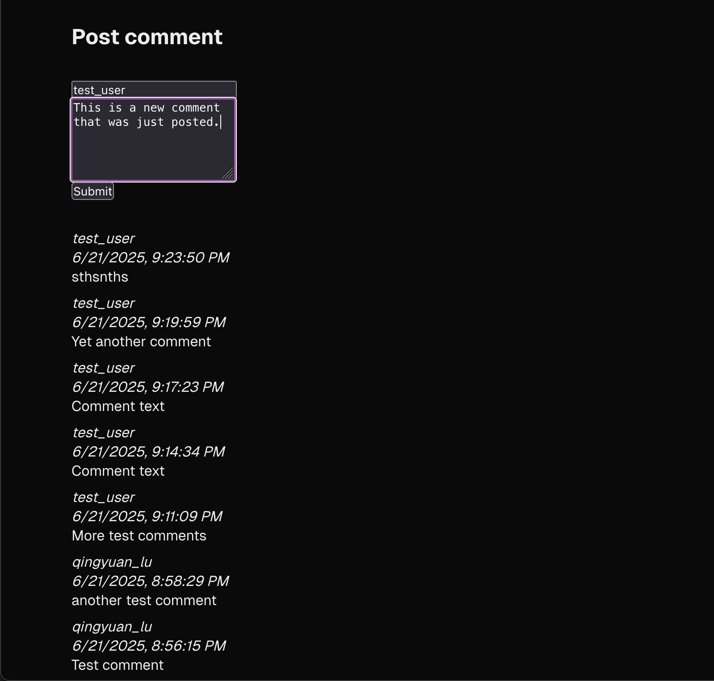
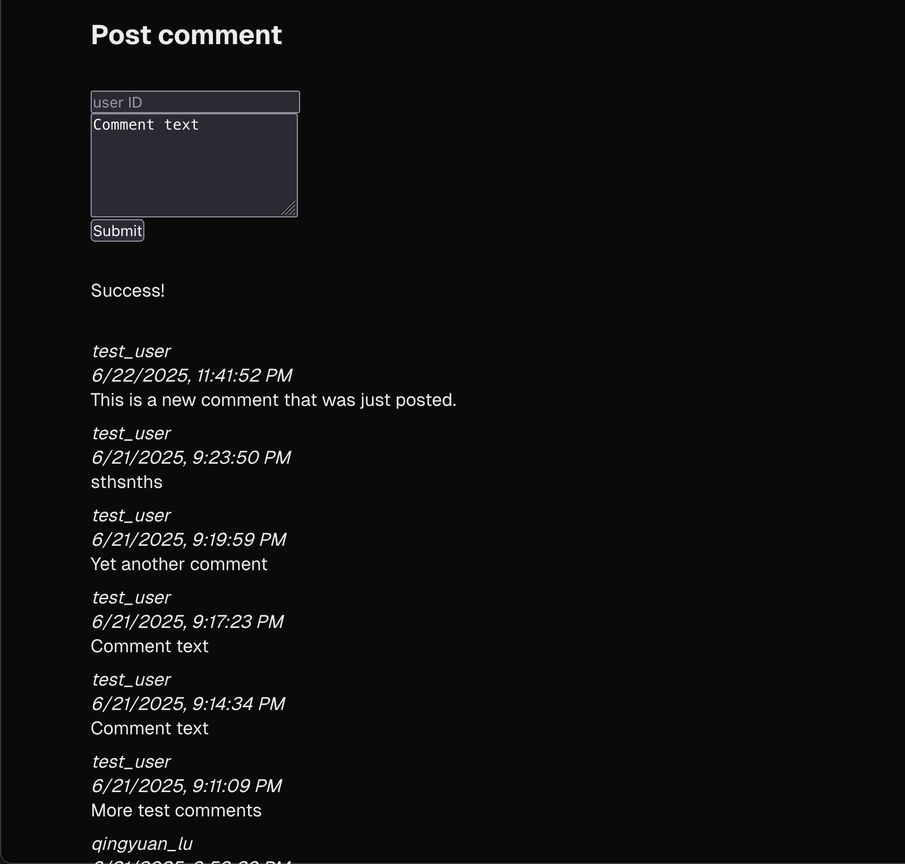
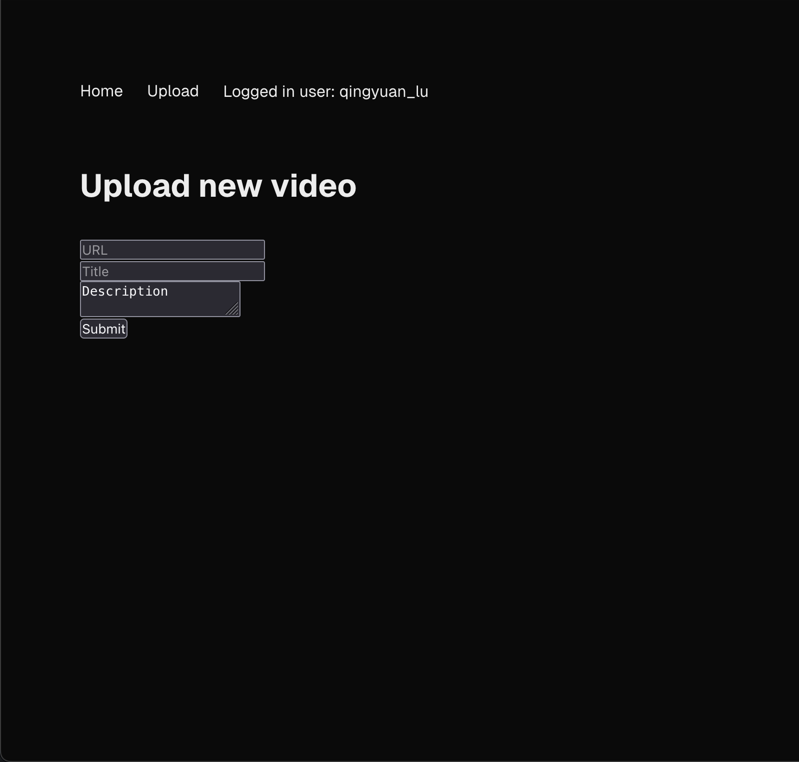
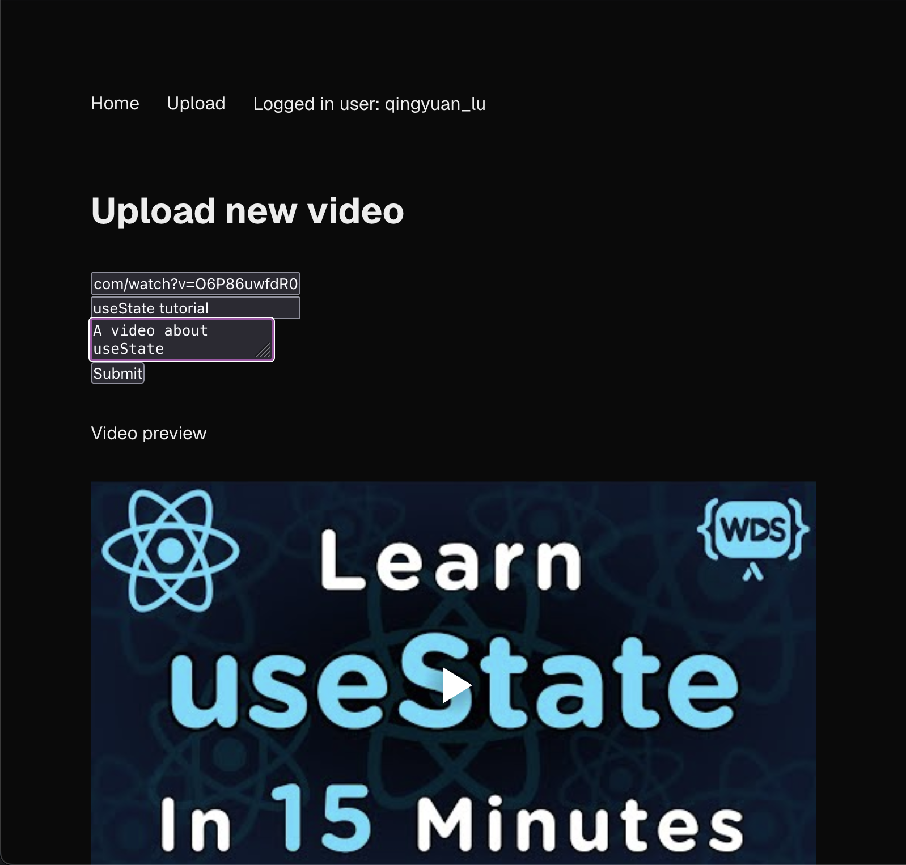

## Build instructions

Build and run the site using npm.

```bash
npm install
npm build
npm start
```

Open [http://localhost:3000](http://localhost:3000) with your browser to see the result.

## Site tour

### Log in
The first thing you will see is a login page which prompts you to enter a user ID. This will be the user ID used to fetch the list of posted videos and the user ID associated with video uploads.



### Home page
After logging in, all pages contain a header bar with links to the Home and Upload pages, as well as the logged in user.

The home page contains a list of videos posted by the logged in user, with the title, thumbnail, user ID, timestamp, and number of comments.



### Video page
Clicking on the title of a video from the home page will bring you to a page for that video.

This page displays the title, user ID, timestamp, and description. The player embeds with controls from the source of the video (YouTube controls in this case).



If you scroll down, you will see a list of comments and a form to post a new comment.



After clicking submit, a status message will show and the list of comments will immediately update with the new comment.



### Upload page
To upload a new video, click "Upload" on the header bar from any page.

You can enter a URL, title, and description for the new video.



After entering a valid URL in the form, a thumbnail preview of the video will appear below the upload form.

